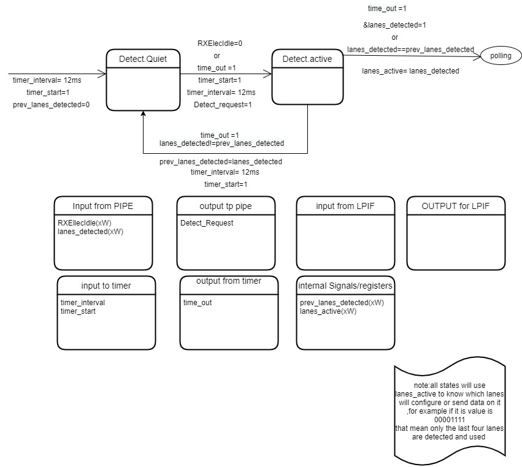
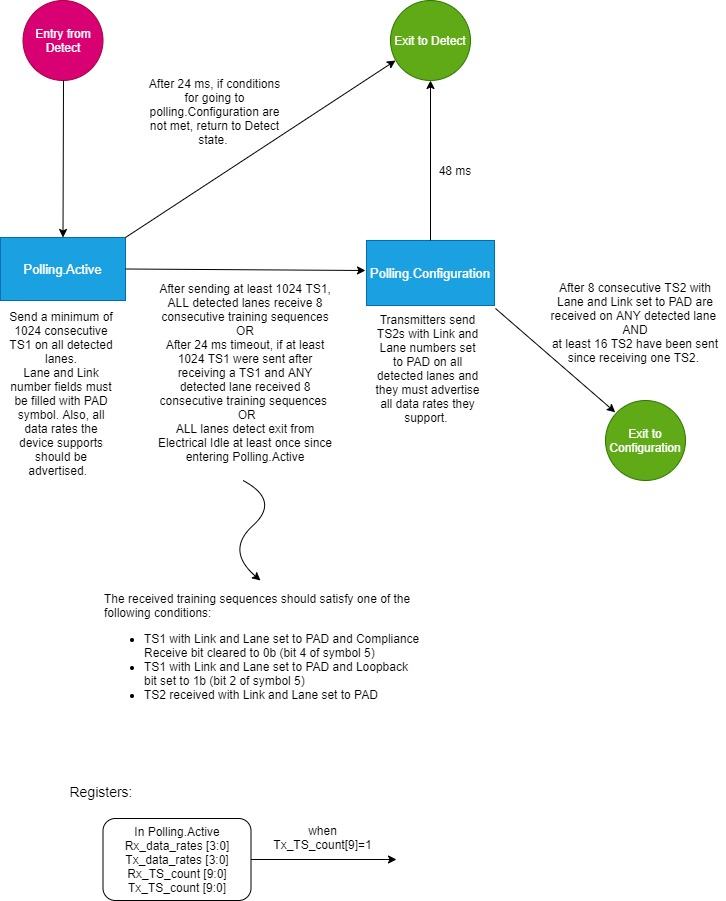
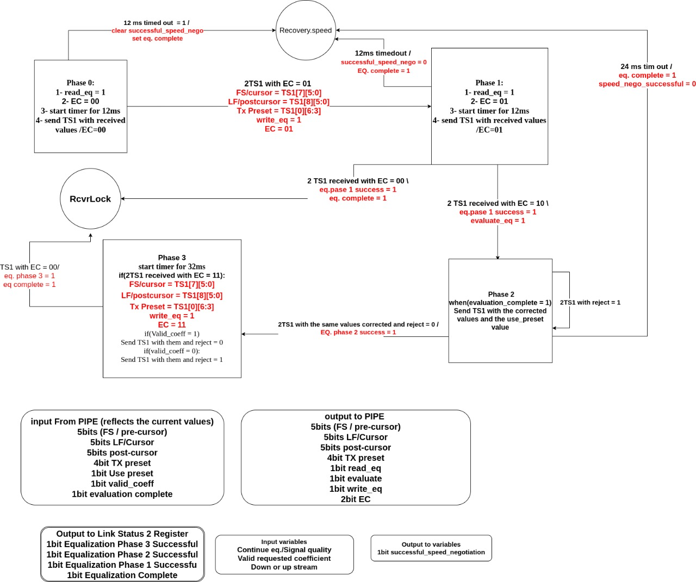
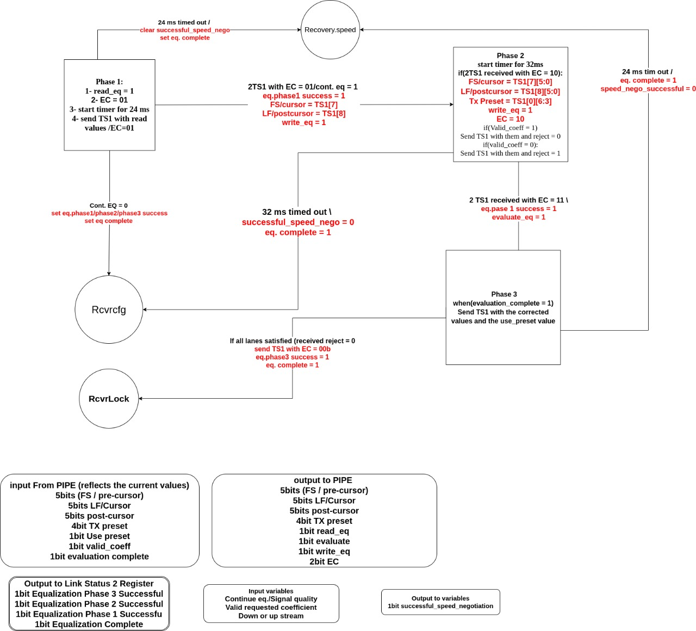
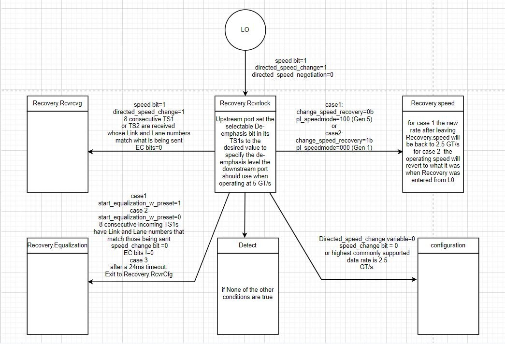
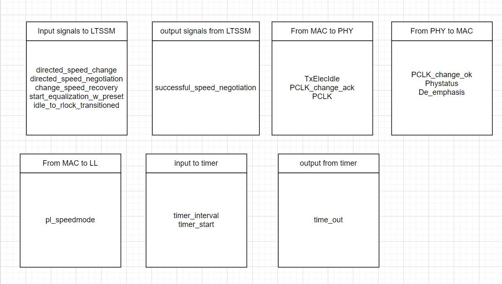
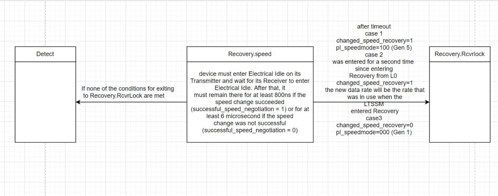
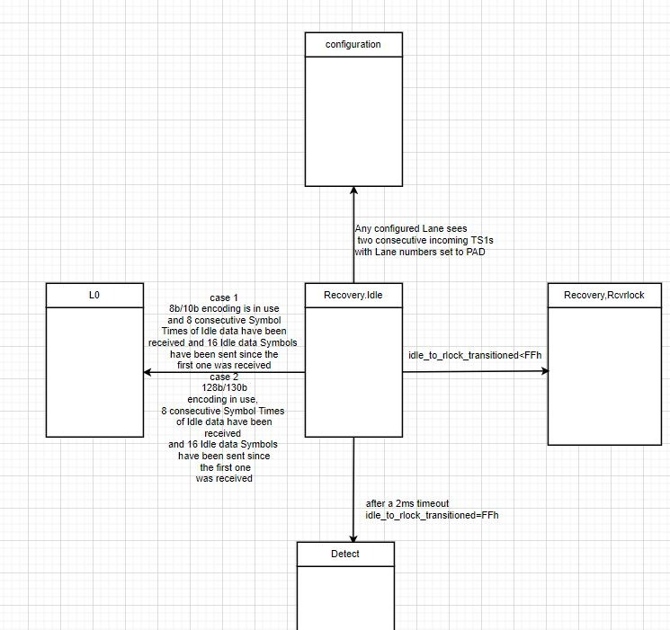
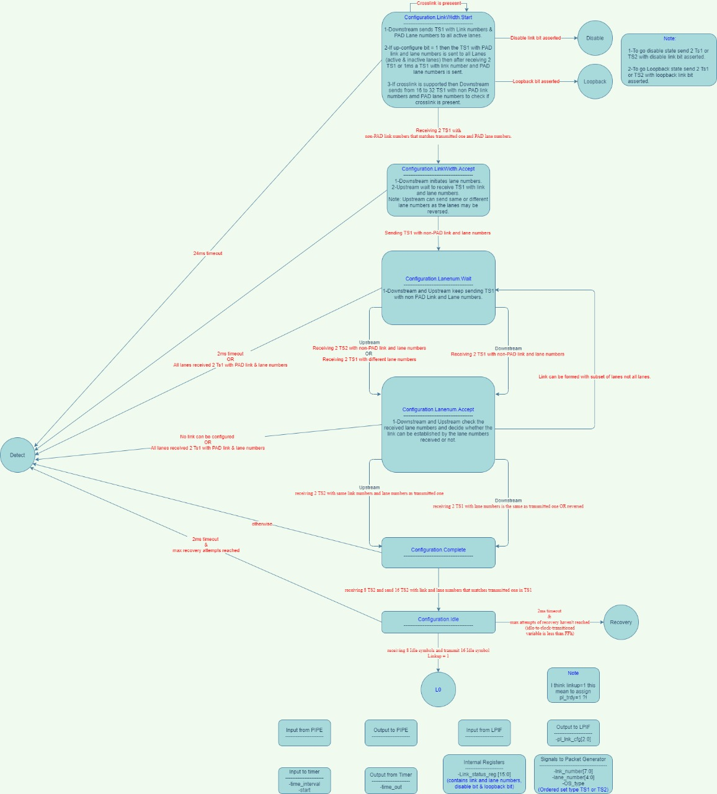

# Detect State

# Polling State

# Recovery State
## Upstream equalization

## Downstream equalization

## L0 entre to Recovery

## Signals for Recovery State

## Recovery speed transitions

## Recovery idle transitions

# Configuration State 

