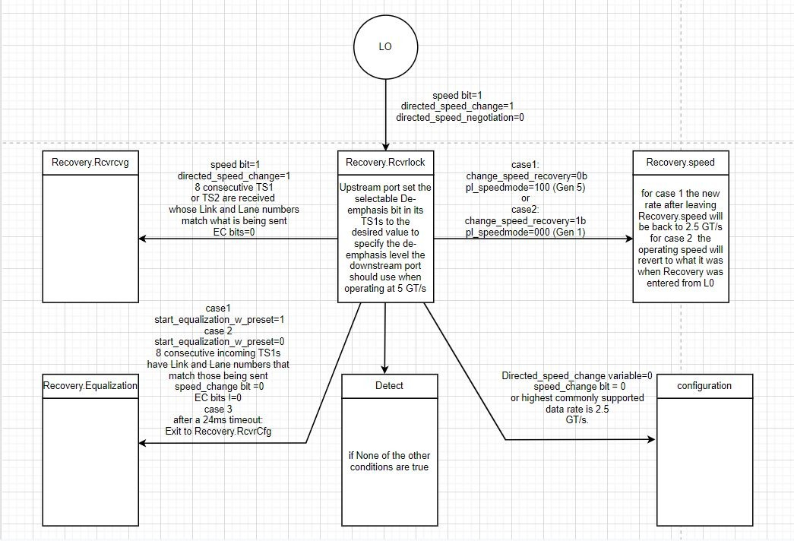
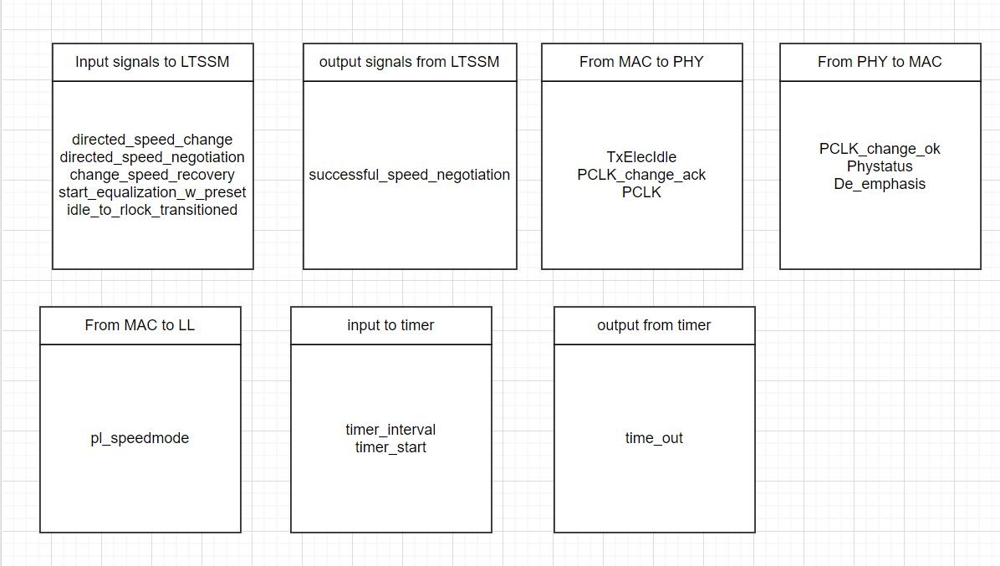
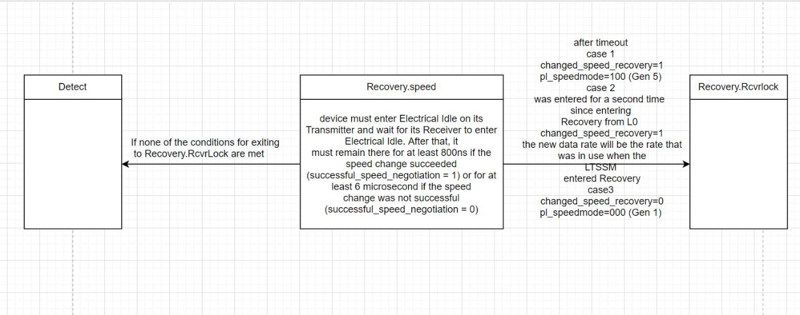
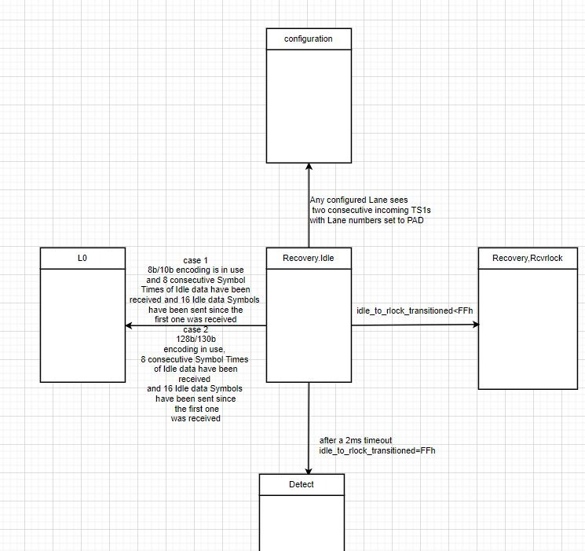

# PCIe_specs

## Detect

## Configuration

## Recovery.Equalization
1. Downstream state diagram

2. Upstream state diagram

3. L0 entre to Recovery

4. Signals for Recovery State

5. Recovery speed transitions

6. Recovery idle transitions

